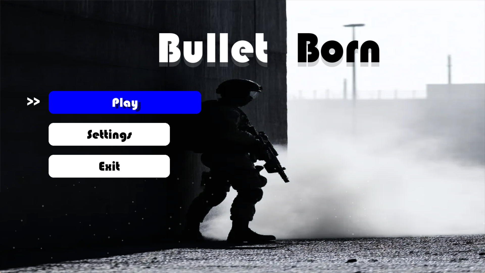
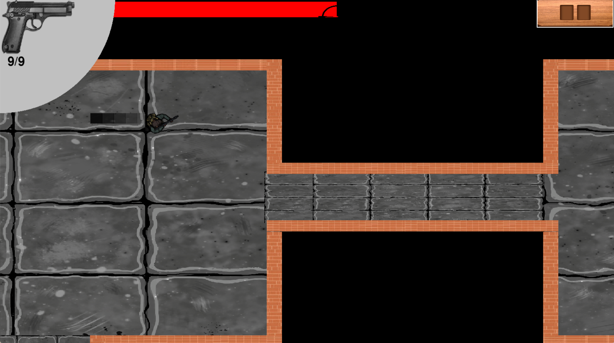
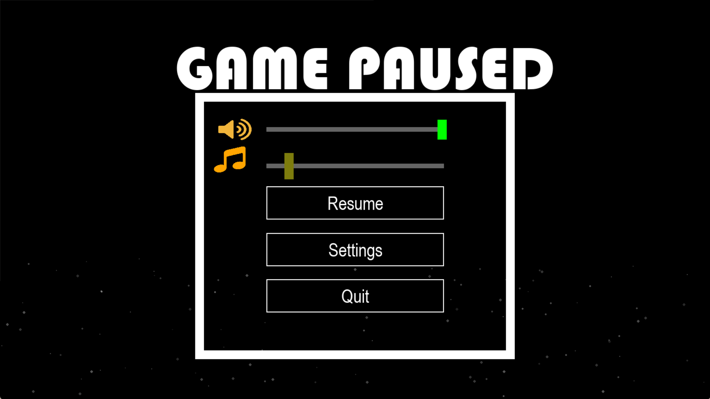

# 🎮 Bullet Born  

*A 2D roguelike shooter with procedural dungeons, permadeath, and dynamic combat.*  
## 🖼️ Screenshots

| Screenshot 1 | Screenshot 2 | Screenshot 3 |
|--------------|--------------|--------------|
|  |  |  |
| *Main_menu* | *Game_play* | *Game_paused*|

## ✨ Features  
- **Procedural Dungeons**: Randomly generated rooms and corridors.  
- **Weapon System**: 3 unique fire modes (pistol, shotgun, sniper).  
- **Permadeath & Progression**: Unlock bonuses after each run.  
- **Dynamic Difficulty**: Adapts to player skill.  

---

## 🚀 How to Run  
### Prerequisites  
- Python 3.8+  
- Pygame 2.0+  

### 🎛️ Controls  
| Key | Action |  
|aroow_keys| | main_menu navigation|
| Enter | choose |
| tab | restart|  
| WASD | Move |  
| LMB  | Shoot |  
| Space | Dash |  
| 1-3  | Switch Weapons |
  

### Installation  
```bash
git clone https://github.com/ML642/Pygame-Project.git
cd Pygame-Project
pip install pygame
python maingame.py

